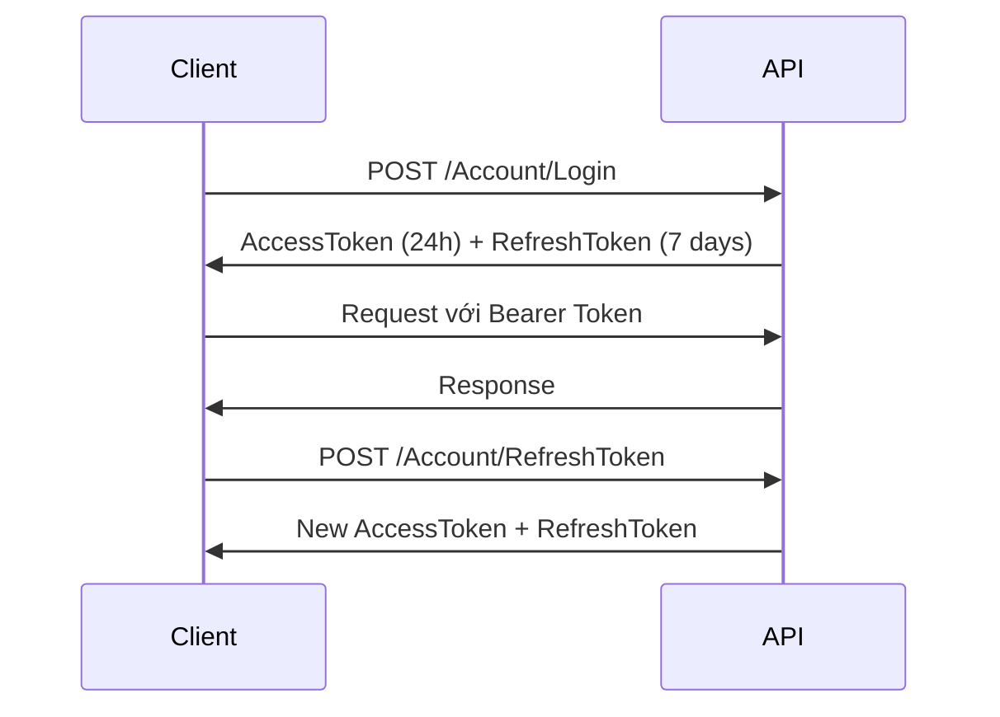

# AutoAppManagement API - Tài Liệu Implementation Guide

## Tổng quan dự án

**AutoAppManagement** là hệ thống quản lý ứng dụng tự động với kiến trúc **ASP.NET Core 8.0**, bao gồm API backend và WebApp frontend.

### Tech Stack
- **Framework**: .NET 8.0
- **Database**: SQL Server
- **Authentication**: JWT Bearer Token
- **Architecture**: Clean Architecture (Models, Repository, Service, API)
- **Deployment**: Docker, Docker Compose

---

## Kiến trúc dự án

```
AutoAppManagement/
├── AutoAppManagement.API/          # REST API Layer
├── AutoAppManagement.WebApp/       # Frontend Layer
├── AutoAppManagement.Models/       # Domain Models & DTOs
├── AutoAppManagement.Repository/   # Data Access Layer
├── AutoAppManagement.Service/      # Business Logic Layer
└── docker/                         # Docker configuration
```

### Các thành phần chính

1. **API Layer** - Xử lý HTTP requests/responses
2. **Service Layer** - Business logic và validation
3. **Repository Layer** - Truy xuất database
4. **Models Layer** - Entity models và DTOs

---

## Base URL

### Development
```
http://localhost:8081/api
```

### Production
```
http://tlsoftware.io.vn/api
```

---

## Authentication & Authorization

### JWT Token Flow



### Token Configuration
- **Access Token Lifetime**: 24 giờ
- **Refresh Token Lifetime**: 7 ngày
- **Token Type**: Bearer JWT
- **Secret Key**: Cấu hình trong `appsettings.json`

### Authorization Header Format
```
Authorization: Bearer {your_jwt_token}
```

---

## API Endpoints

### 1. Account Management

#### 1.1 Login
**Endpoint**: `POST /api/Account/Login`

**Request Body**:
```json
{
  "emailOrPhone": "user@example.com",
  "password": "YourPassword123!"
}
```

**Response**:
```json
{
  "isSuccess": true,
  "message": "Đăng nhập thành công",
  "data": {
    "token": "eyJhbGciOiJIUzI1NiIsInR5cCI6IkpXVCJ9...",
    "refreshToken": "CfDJ8M2Ww5BjNqtNuAiAEcNm6ck...",
    "accessTokenExpired": "2024-10-25T10:30:00Z",
    "refreshTokenExpired": "2024-10-31T10:30:00Z",
    "loginTime": "2024-10-24T10:30:00Z",
    "licenseInfo": {
      "licenseId": 1,
      "licenseName": "Premium License",
      "licenseType": "Premium",
      "status": 1,
      "daysRemaining": 365
    }
  }
}
```

---

#### 1.2 Change Password (Admin Only)
**Endpoint**: `POST /api/Account/ChangePassword`

**Authorization**: Required (Admin role)

**Request Body**:
```json
{
  "id": 123,
  "newPassword": "NewStrongPass123!"
}
```

**Response**:
```json
{
  "isSuccess": true,
  "message": "Đổi mật khẩu thành công"
}
```

---

#### 1.3 Send OTP for Change Password
**Endpoint**: `POST /api/Account/SendOtpForChangePassword`

**Authorization**: Required

**Request Body**: None (lấy accountId từ JWT token)

**Response**:
```json
{
  "isSuccess": true,
  "message": "Mã OTP đã được gửi đến email của bạn",
  "data": {
    "maskedEmail": "u***r@example.com",
    "expiresIn": 300
  }
}
```

---

#### 1.4 Change Password with OTP
**Endpoint**: `POST /api/Account/ChangePasswordWithOtp`

**Authorization**: Required

**Request Body**:
```json
{
  "accountId": 123,
  "oldPassword": "OldPassword123!",
  "newPassword": "NewPassword123!",
  "otp": "123456"
}
```

**Response**:
```json
{
  "isSuccess": true,
  "message": "Đổi mật khẩu thành công"
}
```

---

#### 1.5 Forgot Password
**Endpoint**: `POST /api/Account/ForgotPassword`

**Authorization**: None (Public)

**Request Body**:
```json
{
  "emailOrPhone": "user@example.com"
}
```

**Response**:
```json
{
  "isSuccess": true,
  "message": "Mã OTP đã được gửi đến email của bạn",
  "data": {
    "maskedEmail": "u***r@example.com"
  }
}
```

---

#### 1.6 Confirm OTP & Reset Password
**Endpoint**: `POST /api/Account/ConfirmOtpResetPassword`

**Authorization**: None (Public)

**Request Body**:
```json
{
  "email": "user@example.com",
  "otp": "123456"
}
```

**Response**:
```json
{
  "isSuccess": true,
  "message": "Mật khẩu mới đã được gửi đến email của bạn",
  "data": {
    "maskedEmail": "u***r@example.com"
  }
}
```

---

#### 1.7 Resend OTP for Reset Password
**Endpoint**: `POST /api/Account/ResendOtpForResetPassword`

**Authorization**: None (Public)

**Request Body**:
```json
{
  "emailOrPhone": "user@example.com"
}
```

**Response**:
```json
{
  "isSuccess": true,
  "message": "Mã OTP đã được gửi lại"
}
```

---

#### 1.8 Resend OTP for Change Password
**Endpoint**: `POST /api/Account/ResendOtpForChangePassword`

**Authorization**: Required

**Request Body**: None

**Response**:
```json
{
  "isSuccess": true,
  "message": "Mã OTP đã được gửi lại"
}
```

---

#### 1.9 Lock Account
**Endpoint**: `POST /api/Account/LockAccount`

**Authorization**: Required (Admin role)

**Request Body**:
```json
{
  "id": 123,
  "reason": "Vi phạm chính sách"
}
```

**Response**:
```json
{
  "isSuccess": true,
  "message": "Khóa tài khoản thành công"
}
```

---

#### 1.10 Unlock Account
**Endpoint**: `POST /api/Account/UnlockAccount?id={accountId}`

**Authorization**: Required (Admin role)

**Response**:
```json
{
  "isSuccess": true,
  "message": "Mở khóa tài khoản thành công"
}
```

---

#### 1.11 Refresh Token
**Endpoint**: `POST /api/Account/RefreshToken`

**Request Body**:
```json
{
  "refreshToken": "CfDJ8M2Ww5BjNqtNuAiAEcNm6ck..."
}
```

**Response**:
```json
{
  "isSuccess": true,
  "message": "Refresh token thành công",
  "data": {
    "accessToken": "eyJhbGciOiJIUzI1NiIsInR5cCI6IkpXVCJ9...",
    "accessTokenExpired": "2024-10-25T11:30:00Z",
    "refreshToken": "CfDJ8N3Xx6CkOruOvBjBFdOo7dl...",
    "refreshTokenExpired": "2024-11-01T11:30:00Z"
  }
}
```

---

#### 1.12 Revoke Token
**Endpoint**: `POST /api/Account/RevokeToken`

**Authorization**: Required

**Request Body**:
```json
{
  "token": "CfDJ8M2Ww5BjNqtNuAiAEcNm6ck..."
}
```

**Response**:
```json
{
  "isSuccess": true,
  "message": "Thu hồi token thành công"
}
```

---

#### 1.13 Revoke All Tokens
**Endpoint**: `POST /api/Account/RevokeAllTokens`

**Authorization**: Required

**Response**:
```json
{
  "isSuccess": true,
  "message": "Thu hồi tất cả token thành công"
}
```

---

#### 1.14 Get Account by Username
**Endpoint**: `GET /api/Account/GetAccountByUsername?username={username}`

**Authorization**: Required (Admin role)

**Response**:
```json
{
  "isSuccess": true,
  "message": "Success",
  "data": {
    "id": 123,
    "username": "user@example.com",
    "email": "user@example.com",
    "phoneNumber": "0123456789",
    "fullName": "Nguyen Van A",
    "status": 1,
    "createdAt": "2024-01-01T00:00:00Z"
  }
}
```

---

#### 1.15 Get Account by ID
**Endpoint**: `GET /api/Account/GetById/{id}`

**Authorization**: Required (Admin or Customer)

**Response**:
```json
{
  "isSuccess": true,
  "message": "Success",
  "data": {
    "id": 123,
    "username": "user@example.com",
    "email": "user@example.com",
    "phoneNumber": "0123456789",
    "fullName": "Nguyen Van A",
    "status": 1
  }
}
```

---

### 2. Admin Account Management

#### 2.1 Admin Login
**Endpoint**: `POST /api/AdminAccount/Login`

**Request Body**:
```json
{
  "username": "admin",
  "password": "AdminPassword123!"
}
```

**Response**: Tương tự Account Login

---

### 3. License Management

#### 3.1 Get All Licenses
**Endpoint**: `GET /api/License/GetAll`

**Authorization**: Required (Admin)

**Response**:
```json
{
  "isSuccess": true,
  "data": [
    {
      "id": 1,
      "name": "Premium License",
      "type": "Premium",
      "duration": 365,
      "price": 1000000,
      "status": 1
    }
  ]
}
```

---

#### 3.2 Assign License
**Endpoint**: `POST /api/License/Assign`

**Authorization**: Required (Admin)

**Request Body**:
```json
{
  "accountId": 123,
  "licenseId": 1,
  "startDate": "2024-10-24T00:00:00Z",
  "endDate": "2025-10-24T00:00:00Z"
}
```

**Response**:
```json
{
  "isSuccess": true,
  "message": "Gán license thành công"
}
```

---

### 4. Role & Permission Management

#### 4.1 Get All Roles
**Endpoint**: `GET /api/Role/GetAll`

**Authorization**: Required (Admin)

**Response**:
```json
{
  "isSuccess": true,
  "data": [
    {
      "id": 1,
      "name": "Admin",
      "description": "Administrator role"
    },
    {
      "id": 2,
      "name": "Customer",
      "description": "Customer role"
    }
  ]
}
```

---

#### 4.2 Get All Permissions
**Endpoint**: `GET /api/Permission/GetAll`

**Authorization**: Required (Admin)

**Response**:
```json
{
  "isSuccess": true,
  "data": [
    {
      "id": 1,
      "name": "ViewAccount",
      "description": "View account information"
    },
    {
      "id": 2,
      "name": "EditAccount",
      "description": "Edit account information"
    }
  ]
}
```

---

### 5. Notification Management

#### 5.1 Get User Notifications
**Endpoint**: `GET /api/Notification/GetUserNotifications`

**Authorization**: Required

**Response**:
```json
{
  "isSuccess": true,
  "data": [
    {
      "id": 1,
      "title": "Welcome",
      "message": "Welcome to AutoAppManagement",
      "isRead": false,
      "createdAt": "2024-10-24T10:00:00Z"
    }
  ]
}
```

---

#### 5.2 Mark Notification as Read
**Endpoint**: `POST /api/Notification/MarkAsRead/{id}`

**Authorization**: Required

**Response**:
```json
{
  "isSuccess": true,
  "message": "Đánh dấu đã đọc thành công"
}
```

---

### 6. AI Config Management

#### 6.1 Get AI Config
**Endpoint**: `GET /api/AIConfig/GetConfig`

**Authorization**: Required (Admin)

**Response**:
```json
{
  "isSuccess": true,
  "data": {
    "apiKey": "sk-***",
    "model": "gpt-4",
    "maxTokens": 2000,
    "temperature": 0.7
  }
}
```

---

### 7. File Upload

#### 7.1 Upload File
**Endpoint**: `POST /api/File/Upload`

**Authorization**: Required

**Request**: Multipart/form-data

**Response**:
```json
{
  "isSuccess": true,
  "message": "Upload thành công",
  "data": {
    "fileUrl": "https://example.com/files/abc123.jpg",
    "fileName": "avatar.jpg",
    "fileSize": 102400
  }
}
```

---

### 8. Feature Management

#### 8.1 Get Available Features
**Endpoint**: `GET /api/FeatureManagement/GetAvailableFeatures`

**Authorization**: Required

**Response**:
```json
{
  "isSuccess": true,
  "data": [
    {
      "id": 1,
      "name": "Advanced Search",
      "description": "Advanced search functionality",
      "isAvailable": true
    }
  ]
}
```

---

## Error Responses

### Cấu trúc lỗi chung

```json
{
  "isSuccess": false,
  "message": "Chi tiết lỗi",
  "errors": [
    "Validation error 1",
    "Validation error 2"
  ]
}
```

### HTTP Status Codes

| Code | Ý nghĩa |
|------|---------|
| 200  | Success |
| 400  | Bad Request - Dữ liệu không hợp lệ |
| 401  | Unauthorized - Chưa đăng nhập |
| 403  | Forbidden - Không có quyền truy cập |
| 404  | Not Found - Không tìm thấy resource |
| 500  | Internal Server Error |

---

## Data Models

### Account Model

```csharp
public class Account
{
    public long Id { get; set; }
    public string Username { get; set; }
    public string Email { get; set; }
    public string PhoneNumber { get; set; }
    public string FullName { get; set; }
    public int Status { get; set; } // 1: Active, 0: Inactive, -1: Locked
    public DateTime CreatedAt { get; set; }
    public DateTime? UpdatedAt { get; set; }
}
```

### License Model

```csharp
public class License
{
    public long Id { get; set; }
    public string Name { get; set; }
    public string Type { get; set; }
    public int Duration { get; set; } // Số ngày
    public decimal Price { get; set; }
    public int Status { get; set; }
}
```

### Notification Model

```csharp
public class Notification
{
    public long Id { get; set; }
    public long AccountId { get; set; }
    public string Title { get; set; }
    public string Message { get; set; }
    public bool IsRead { get; set; }
    public DateTime CreatedAt { get; set; }
}
```

---

## Password Rules

### Quy tắc mật khẩu mạnh
- Tối thiểu 8 ký tự
- Phải có chữ hoa (A-Z)
- Phải có chữ thường (a-z)
- Phải có số (0-9)
- Phải có ký tự đặc biệt (!@#$%^&*)
- Điểm số tối thiểu: 60/100

### Ví dụ mật khẩu hợp lệ
- `MyP@ssw0rd123`
- `Secure!Pass99`
- `Strong#2024Pwd`

---

## Rate Limiting

API có áp dụng rate limiting để chống DDOS:

- **Requests per IP**: 100 requests / 5 phút
- **Requests per endpoint**: 30 requests / phút

Khi vượt quá giới hạn, API sẽ trả về HTTP 429 (Too Many Requests).

---

## CORS Configuration

Các domain được phép:
- `https://localhost:44388` (Development)
- `http://tlsoftware.io.vn` (Production)

---

## Database Configuration

### Connection String Format

```
Data Source={server},{port};
Initial Catalog={database};
Persist Security Info=True;
User ID={username};
Password={password};
Pooling=False;
Multiple Active Result Sets=False;
Encrypt=True;
Trust Server Certificate=True;
Command Timeout=0
```

### Production Database
- **Host**: 125.253.121.206:1433
- **Database**: AutoAppManagement
- **Encryption**: Enabled

---

## Deployment

### Docker Deployment

#### Development
```bash
docker-compose up --build -d
```

#### Production
```bash
docker-compose -f docker/docker-compose.production.yml up --build -d
```

### Environment Variables

```env
ASPNETCORE_ENVIRONMENT=Production
ASPNETCORE_URLS=http://0.0.0.0:80
ConnectionStrings__DefaultConnection={your_connection_string}
Jwt__SecretKey={your_secret_key}
Jwt__ExpiryMinutes=1440
```

---

## Testing với cURL

### Login Example
```bash
curl -X POST "http://localhost:8081/api/Account/Login" \
  -H "Content-Type: application/json" \
  -d '{
    "emailOrPhone": "user@example.com",
    "password": "password123"
  }'
```

### Authenticated Request Example
```bash
curl -X GET "http://localhost:8081/api/Account/GetById/123" \
  -H "Authorization: Bearer YOUR_JWT_TOKEN" \
  -H "Content-Type: application/json"
```

---

## Best Practices

### 1. Security
- Luôn sử dụng HTTPS trong production
- Không hardcode credentials
- Refresh token khi gần hết hạn
- Revoke token khi logout

### 2. Error Handling
- Kiểm tra `isSuccess` trong response
- Log errors để debug
- Hiển thị message thân thiện cho user

### 3. Token Management
- Lưu token an toàn (HttpOnly cookies hoặc secure storage)
- Implement auto-refresh token
- Clear token khi logout

### 4. API Calls
- Sử dụng retry logic cho network errors
- Implement timeout
- Cache data khi có thể

---

## Support & Contact

Nếu có vấn đề khi implement, vui lòng liên hệ:
- **Email**: support@tlsoftware.io.vn
- **Website**: http://tlsoftware.io.vn

---

## Changelog

### Version 1.0.0 (2024-10-24)
- Initial release
- Account management APIs
- License management
- Role & Permission system
- OTP verification system
- Docker deployment support

---

## Appendix

### Useful Links
- [ASP.NET Core Documentation](https://docs.microsoft.com/aspnet/core)
- [JWT.io](https://jwt.io)
- [Docker Documentation](https://docs.docker.com)
- [SQL Server Documentation](https://docs.microsoft.com/sql)
