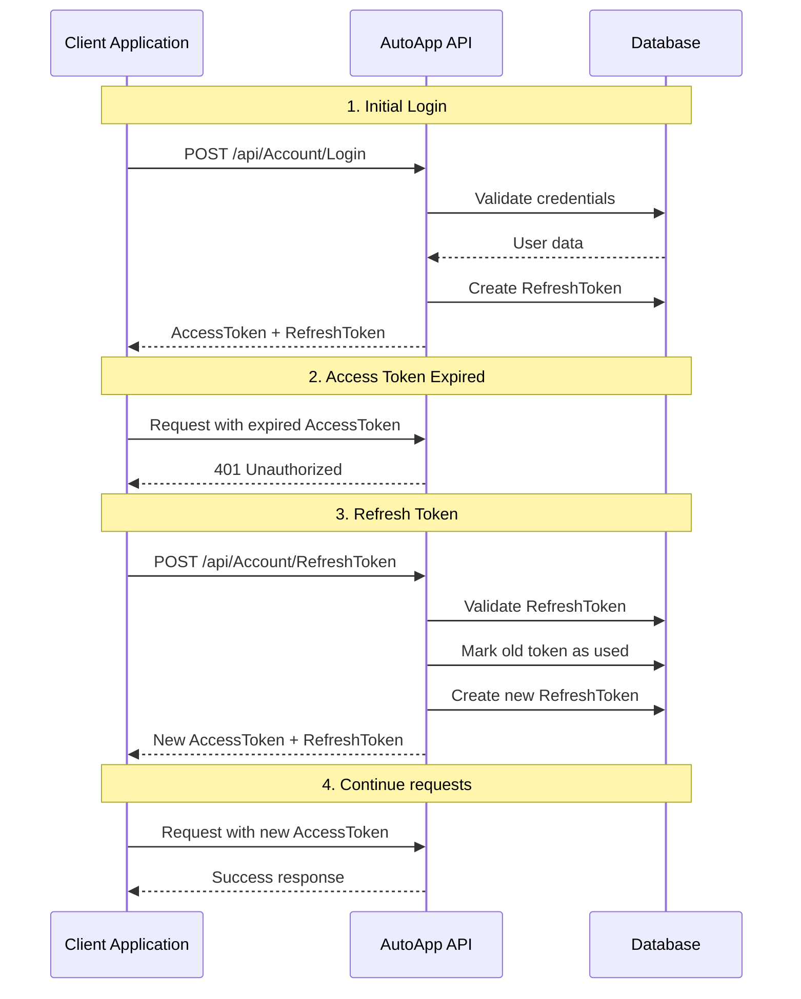

# Token Refresh Flow - Integration Guide for External Tools/AI

> **Mục đích**: Tài liệu này hướng dẫn chi tiết cách implement Token Refresh mechanism để tích hợp với AutoAppManagement API. Phù hợp cho AI code generation, external tools, và third-party applications.

---

## 📋 Table of Contents
1. [Flow Overview](#flow-overview)
2. [API Specifications](#api-specifications)
3. [Implementation Requirements](#implementation-requirements)
4. [Code Examples](#code-examples)
5. [Error Handling](#error-handling)
6. [Testing Checklist](#testing-checklist)

---

## 🔄 Flow Overview

### Tổng quan luồng xử lý Token



### Token Lifecycle States

| State | Description | Action Required |
|-------|-------------|-----------------|
| **Valid** | Token còn hạn và chưa bị thu hồi | Use normally |
| **Expired** | Token hết hạn | Use RefreshToken to get new tokens |
| **Revoked** | Token bị thu hồi (logout, security) | Re-login required |
| **Used** | RefreshToken đã được sử dụng | Cannot reuse, must use new token |

---

## 🔌 API Specifications

### 1. Login API (Get Initial Tokens)

#### Endpoint
```
POST /api/Account/Login
```

#### Request Headers
```http
Content-Type: application/json
```

#### Request Body
```json
{
  "emailOrPhone": "string",
  "password": "string"
}
```

**Field Specifications:**
- `emailOrPhone`: Email hoặc số điện thoại (required)
- `password`: Mật khẩu (required, min 8 chars)

#### Response Success (200 OK)
```json
{
  "isSuccess": true,
  "message": "Đăng nhập thành công",
  "data": {
    "token": "eyJhbGciOiJIUzI1NiIsInR5cCI6IkpXVCJ9.eyJuYW1laWQiOiIxMjMi...",
    "refreshToken": "CfDJ8M2Ww5BjNqtNuAiAEcNm6ckG1ZtHWK0PQR2+5STU...",
    "accessTokenExpired": "2024-10-25T10:30:00Z",
    "refreshTokenExpired": "2024-10-31T10:30:00Z",
    "loginTime": "2024-10-24T10:30:00Z",
    "licenseInfo": {
      "licenseId": 1,
      "licenseName": "Premium License",
      "licenseType": "Premium",
      "status": 1,
      "daysRemaining": 365
    }
  }
}
```

**Important Response Fields:**
- `data.token`: Access Token (JWT) - Use in Authorization header
- `data.refreshToken`: Refresh Token - Use to get new Access Token
- `data.accessTokenExpired`: ISO 8601 datetime - When Access Token expires
- `data.refreshTokenExpired`: ISO 8601 datetime - When Refresh Token expires

#### Response Error (400/401)
```json
{
  "isSuccess": false,
  "message": "Tài khoản hoặc mật khẩu không chính xác"
}
```

---

### 2. Refresh Token API

#### Endpoint
```
POST /api/Account/RefreshToken
```

#### Request Headers
```http
Content-Type: application/json
```

**Note:** Authorization header is NOT required for this endpoint

#### Request Body
```json
{
  "refreshToken": "string"
}
```

**Field Specifications:**
- `refreshToken`: The refresh token string received from Login or previous Refresh (required)

#### Response Success (200 OK)
```json
{
  "isSuccess": true,
  "message": "Refresh token thành công",
  "data": {
    "accessToken": "eyJhbGciOiJIUzI1NiIsInR5cCI6IkpXVCJ9.NEW_TOKEN...",
    "accessTokenExpired": "2024-10-25T11:30:00Z",
    "refreshToken": "CfDJ8N3Xx6CkOruOvBjBFdOo7dl+NEW_REFRESH_TOKEN...",
    "refreshTokenExpired": "2024-11-01T11:30:00Z"
  }
}
```

**Important Notes:**
1. **Old tokens become invalid**: Previous AccessToken và RefreshToken are marked as used
2. **Use new tokens immediately**: Store and use the new tokens from response
3. **Token Rotation**: Each refresh generates completely new tokens

#### Response Errors

##### 400 Bad Request - Invalid Token
```json
{
  "isSuccess": false,
  "message": "Refresh token không hợp lệ"
}
```

##### 401 Unauthorized - Expired or Revoked
```json
{
  "isSuccess": false,
  "message": "Refresh token đã hết hạn hoặc bị thu hồi"
}
```

##### 403 Forbidden - Account Locked
```json
{
  "isSuccess": false,
  "message": "Tài khoản đã bị khóa"
}
```

---

### 3. Revoke Token API (Optional - for Logout)

#### Endpoint
```
POST /api/Account/RevokeToken
```

#### Request Headers
```http
Authorization: Bearer <ACCESS_TOKEN>
Content-Type: application/json
```

#### Request Body
```json
{
  "token": "string"
}
```

#### Response Success (200 OK)
```json
{
  "isSuccess": true,
  "message": "Thu hồi token thành công"
}
```

---

### 4. Revoke All Tokens API (Logout All Devices)

#### Endpoint
```
POST /api/Account/RevokeAllTokens
```

#### Request Headers
```http
Authorization: Bearer <ACCESS_TOKEN>
Content-Type: application/json
```

#### Request Body
```
No body required
```

#### Response Success (200 OK)
```json
{
  "isSuccess": true,
  "message": "Thu hồi tất cả token thành công"
}
```

---

## 💻 Implementation Requirements

### Must-Have Features

#### 1. Token Storage
```
✅ Store AccessToken securely
✅ Store RefreshToken securely
✅ Store AccessTokenExpiry datetime
✅ Store RefreshTokenExpiry datetime
```

**Storage Options:**
- **Web/Mobile**: Secure storage (Keychain/KeyStore) or HttpOnly cookies
- **Desktop Apps**: Encrypted local storage
- **Server-to-Server**: Environment variables or secret management

#### 2. Token Validation
```
✅ Check if AccessToken is expired before each API call
✅ Compare current time with AccessTokenExpiry
✅ Add buffer time (e.g., refresh 5 minutes before expiry)
```

#### 3. Automatic Token Refresh
```
✅ Detect 401 Unauthorized responses
✅ Automatically call RefreshToken API
✅ Retry original request with new token
✅ Handle refresh failures gracefully
```

#### 4. Error Handling
```
✅ Handle network errors
✅ Handle invalid refresh token
✅ Handle expired refresh token
✅ Redirect to login when refresh fails
```

---

## 📝 Code Examples

### Example 1: Python Implementation

```python
import requests
from datetime import datetime, timedelta
import json

class TokenManager:
    def __init__(self, base_url: str):
        self.base_url = base_url
        self.access_token = None
        self.refresh_token = None
        self.access_token_expiry = None
        self.refresh_token_expiry = None
    
    def login(self, email_or_phone: str, password: str) -> bool:
        """
        Login and store tokens
        Returns True if successful, False otherwise
        """
        url = f"{self.base_url}/api/Account/Login"
        payload = {
            "emailOrPhone": email_or_phone,
            "password": password
        }
        headers = {
            "Content-Type": "application/json"
        }
        
        try:
            response = requests.post(url, json=payload, headers=headers)
            response.raise_for_status()
            
            data = response.json()
            if data.get("isSuccess"):
                self._store_tokens(data["data"])
                return True
            else:
                print(f"Login failed: {data.get('message')}")
                return False
        except Exception as e:
            print(f"Login error: {e}")
            return False
    
    def _store_tokens(self, data: dict):
        """Store tokens from API response"""
        self.access_token = data.get("token") or data.get("accessToken")
        self.refresh_token = data["refreshToken"]
        self.access_token_expiry = datetime.fromisoformat(
            data.get("accessTokenExpired").replace('Z', '+00:00')
        )
        self.refresh_token_expiry = datetime.fromisoformat(
            data["refreshTokenExpired"].replace('Z', '+00:00')
        )
        print(f"Tokens stored. Access token expires at: {self.access_token_expiry}")
    
    def is_access_token_expired(self, buffer_minutes: int = 5) -> bool:
        """
        Check if access token is expired or will expire soon
        buffer_minutes: Refresh token X minutes before actual expiry
        """
        if not self.access_token_expiry:
            return True
        
        # Add buffer to refresh before actual expiry
        expiry_with_buffer = self.access_token_expiry - timedelta(minutes=buffer_minutes)
        return datetime.utcnow() >= expiry_with_buffer
    
    def refresh_access_token(self) -> bool:
        """
        Refresh the access token using refresh token
        Returns True if successful, False otherwise
        """
        if not self.refresh_token:
            print("No refresh token available")
            return False
        
        url = f"{self.base_url}/api/Account/RefreshToken"
        payload = {
            "refreshToken": self.refresh_token
        }
        headers = {
            "Content-Type": "application/json"
        }
        
        try:
            response = requests.post(url, json=payload, headers=headers)
            response.raise_for_status()
            
            data = response.json()
            if data.get("isSuccess"):
                self._store_tokens(data["data"])
                print("Token refreshed successfully")
                return True
            else:
                print(f"Refresh failed: {data.get('message')}")
                self.clear_tokens()
                return False
        except Exception as e:
            print(f"Refresh error: {e}")
            self.clear_tokens()
            return False
    
    def get_valid_access_token(self) -> str:
        """
        Get a valid access token, refreshing if necessary
        Returns access token or None if unable to get valid token
        """
        if self.is_access_token_expired():
            print("Access token expired, refreshing...")
            if not self.refresh_access_token():
                print("Failed to refresh token, re-login required")
                return None
        
        return self.access_token
    
    def make_authenticated_request(self, method: str, endpoint: str, **kwargs) -> requests.Response:
        """
        Make an authenticated API request with automatic token refresh
        
        Args:
            method: HTTP method (GET, POST, PUT, DELETE)
            endpoint: API endpoint (e.g., '/api/Account/GetById/123')
            **kwargs: Additional arguments for requests (json, params, etc.)
        
        Returns:
            Response object
        """
        token = self.get_valid_access_token()
        if not token:
            raise Exception("Unable to get valid access token. Please login.")
        
        url = f"{self.base_url}{endpoint}"
        headers = kwargs.pop('headers', {})
        headers["Authorization"] = f"Bearer {token}"
        headers["Content-Type"] = "application/json"
        
        try:
            response = requests.request(method, url, headers=headers, **kwargs)
            
            # If 401, try to refresh once and retry
            if response.status_code == 401:
                print("Received 401, attempting to refresh token...")
                if self.refresh_access_token():
                    headers["Authorization"] = f"Bearer {self.access_token}"
                    response = requests.request(method, url, headers=headers, **kwargs)
                else:
                    raise Exception("Token refresh failed, re-login required")
            
            return response
        except Exception as e:
            print(f"Request error: {e}")
            raise
    
    def clear_tokens(self):
        """Clear all stored tokens"""
        self.access_token = None
        self.refresh_token = None
        self.access_token_expiry = None
        self.refresh_token_expiry = None
        print("Tokens cleared")
    
    def logout(self):
        """Logout and revoke all tokens"""
        if self.access_token:
            try:
                url = f"{self.base_url}/api/Account/RevokeAllTokens"
                headers = {
                    "Authorization": f"Bearer {self.access_token}",
                    "Content-Type": "application/json"
                }
                requests.post(url, headers=headers)
                print("Tokens revoked on server")
            except Exception as e:
                print(f"Logout error: {e}")
        
        self.clear_tokens()


# Usage Example
if __name__ == "__main__":
    # Initialize
    token_manager = TokenManager("http://localhost:8081")
    
    # Login
    if token_manager.login("user@example.com", "password123"):
        print("Login successful!")
        
        # Make authenticated requests
        try:
            # Example: Get account by ID
            response = token_manager.make_authenticated_request(
                "GET", 
                "/api/Account/GetById/123"
            )
            print(f"Response: {response.json()}")
            
            # Example: Update account info
            response = token_manager.make_authenticated_request(
                "PUT",
                "/api/Account/UpdateAccountInfo",
                json={
                    "id": 123,
                    "fullName": "New Name",
                    "phoneNumber": "0123456789"
                }
            )
            print(f"Update response: {response.json()}")
            
        except Exception as e:
            print(f"Error: {e}")
        
        # Logout
        token_manager.logout()
    else:
        print("Login failed!")
```

---

### Example 2: JavaScript/TypeScript Implementation

```typescript
interface LoginResponse {
    isSuccess: boolean;
    message: string;
    data: {
        token: string;
        refreshToken: string;
        accessTokenExpired: string;
        refreshTokenExpired: string;
        loginTime: string;
        licenseInfo?: any;
    };
}

interface RefreshTokenResponse {
    isSuccess: boolean;
    message: string;
    data: {
        accessToken: string;
        accessTokenExpired: string;
        refreshToken: string;
        refreshTokenExpired: string;
    };
}

class TokenManager {
    private baseUrl: string;
    private accessToken: string | null = null;
    private refreshToken: string | null = null;
    private accessTokenExpiry: Date | null = null;
    private refreshTokenExpiry: Date | null = null;
    private isRefreshing: boolean = false;
    private refreshPromise: Promise<boolean> | null = null;

    constructor(baseUrl: string) {
        this.baseUrl = baseUrl;
        this.loadTokensFromStorage();
    }

    /**
     * Login and store tokens
     */
    async login(emailOrPhone: string, password: string): Promise<boolean> {
        try {
            const response = await fetch(`${this.baseUrl}/api/Account/Login`, {
                method: 'POST',
                headers: {
                    'Content-Type': 'application/json'
                },
                body: JSON.stringify({
                    emailOrPhone,
                    password
                })
            });

            const result: LoginResponse = await response.json();

            if (result.isSuccess && result.data) {
                this.storeTokens({
                    accessToken: result.data.token,
                    refreshToken: result.data.refreshToken,
                    accessTokenExpired: result.data.accessTokenExpired,
                    refreshTokenExpired: result.data.refreshTokenExpired
                });
                return true;
            } else {
                console.error('Login failed:', result.message);
                return false;
            }
        } catch (error) {
            console.error('Login error:', error);
            return false;
        }
    }

    /**
     * Store tokens in memory and localStorage
     */
    private storeTokens(data: any): void {
        this.accessToken = data.accessToken || data.token;
        this.refreshToken = data.refreshToken;
        this.accessTokenExpiry = new Date(data.accessTokenExpired);
        this.refreshTokenExpiry = new Date(data.refreshTokenExpired);

        // Persist to localStorage
        localStorage.setItem('accessToken', this.accessToken);
        localStorage.setItem('refreshToken', this.refreshToken);
        localStorage.setItem('accessTokenExpiry', this.accessTokenExpiry.toISOString());
        localStorage.setItem('refreshTokenExpiry', this.refreshTokenExpiry.toISOString());

        console.log('Tokens stored. Access token expires at:', this.accessTokenExpiry);
    }

    /**
     * Load tokens from localStorage
     */
    private loadTokensFromStorage(): void {
        this.accessToken = localStorage.getItem('accessToken');
        this.refreshToken = localStorage.getItem('refreshToken');
        
        const accessExpiry = localStorage.getItem('accessTokenExpiry');
        const refreshExpiry = localStorage.getItem('refreshTokenExpiry');
        
        this.accessTokenExpiry = accessExpiry ? new Date(accessExpiry) : null;
        this.refreshTokenExpiry = refreshExpiry ? new Date(refreshExpiry) : null;
    }

    /**
     * Check if access token is expired or will expire soon
     */
    private isAccessTokenExpired(bufferMinutes: number = 5): boolean {
        if (!this.accessTokenExpiry) return true;
        
        const now = new Date();
        const expiryWithBuffer = new Date(this.accessTokenExpiry.getTime() - bufferMinutes * 60000);
        
        return now >= expiryWithBuffer;
    }

    /**
     * Refresh the access token
     * Prevents multiple simultaneous refresh attempts
     */
    async refreshAccessToken(): Promise<boolean> {
        // If already refreshing, wait for that promise
        if (this.isRefreshing && this.refreshPromise) {
            return this.refreshPromise;
        }

        this.isRefreshing = true;
        this.refreshPromise = this.performRefresh();

        try {
            const result = await this.refreshPromise;
            return result;
        } finally {
            this.isRefreshing = false;
            this.refreshPromise = null;
        }
    }

    /**
     * Perform the actual refresh operation
     */
    private async performRefresh(): Promise<boolean> {
        if (!this.refreshToken) {
            console.error('No refresh token available');
            return false;
        }

        try {
            const response = await fetch(`${this.baseUrl}/api/Account/RefreshToken`, {
                method: 'POST',
                headers: {
                    'Content-Type': 'application/json'
                },
                body: JSON.stringify({
                    refreshToken: this.refreshToken
                })
            });

            const result: RefreshTokenResponse = await response.json();

            if (result.isSuccess && result.data) {
                this.storeTokens(result.data);
                console.log('Token refreshed successfully');
                return true;
            } else {
                console.error('Refresh failed:', result.message);
                this.clearTokens();
                return false;
            }
        } catch (error) {
            console.error('Refresh error:', error);
            this.clearTokens();
            return false;
        }
    }

    /**
     * Get a valid access token, refreshing if necessary
     */
    async getValidAccessToken(): Promise<string | null> {
        if (this.isAccessTokenExpired()) {
            console.log('Access token expired, refreshing...');
            const refreshed = await this.refreshAccessToken();
            if (!refreshed) {
                console.error('Failed to refresh token, re-login required');
                return null;
            }
        }

        return this.accessToken;
    }

    /**
     * Make an authenticated API request with automatic token refresh
     */
    async makeAuthenticatedRequest(
        method: string,
        endpoint: string,
        options: RequestInit = {}
    ): Promise<Response> {
        const token = await this.getValidAccessToken();
        if (!token) {
            throw new Error('Unable to get valid access token. Please login.');
        }

        const url = `${this.baseUrl}${endpoint}`;
        const headers = {
            ...options.headers,
            'Authorization': `Bearer ${token}`,
            'Content-Type': 'application/json'
        };

        let response = await fetch(url, {
            ...options,
            method,
            headers
        });

        // If 401, try to refresh once and retry
        if (response.status === 401) {
            console.log('Received 401, attempting to refresh token...');
            const refreshed = await this.refreshAccessToken();
            
            if (refreshed) {
                // Retry with new token
                headers['Authorization'] = `Bearer ${this.accessToken}`;
                response = await fetch(url, {
                    ...options,
                    method,
                    headers
                });
            } else {
                throw new Error('Token refresh failed, re-login required');
            }
        }

        return response;
    }

    /**
     * Clear all tokens
     */
    clearTokens(): void {
        this.accessToken = null;
        this.refreshToken = null;
        this.accessTokenExpiry = null;
        this.refreshTokenExpiry = null;

        localStorage.removeItem('accessToken');
        localStorage.removeItem('refreshToken');
        localStorage.removeItem('accessTokenExpiry');
        localStorage.removeItem('refreshTokenExpiry');

        console.log('Tokens cleared');
    }

    /**
     * Logout and revoke all tokens
     */
    async logout(): Promise<void> {
        if (this.accessToken) {
            try {
                await fetch(`${this.baseUrl}/api/Account/RevokeAllTokens`, {
                    method: 'POST',
                    headers: {
                        'Authorization': `Bearer ${this.accessToken}`,
                        'Content-Type': 'application/json'
                    }
                });
                console.log('Tokens revoked on server');
            } catch (error) {
                console.error('Logout error:', error);
            }
        }

        this.clearTokens();
    }
}

// Usage Example
async function main() {
    const tokenManager = new TokenManager('http://localhost:8081');

    // Login
    const loginSuccess = await tokenManager.login('user@example.com', 'password123');
    if (loginSuccess) {
        console.log('Login successful!');

        try {
            // Example: Get account by ID
            const response = await tokenManager.makeAuthenticatedRequest(
                'GET',
                '/api/Account/GetById/123'
            );
            const data = await response.json();
            console.log('Account data:', data);

            // Example: Update account info
            const updateResponse = await tokenManager.makeAuthenticatedRequest(
                'PUT',
                '/api/Account/UpdateAccountInfo',
                {
                    body: JSON.stringify({
                        id: 123,
                        fullName: 'New Name',
                        phoneNumber: '0123456789'
                    })
                }
            );
            const updateData = await updateResponse.json();
            console.log('Update response:', updateData);

        } catch (error) {
            console.error('Error:', error);
        }

        // Logout
        await tokenManager.logout();
    } else {
        console.log('Login failed!');
    }
}
```

---

### Example 3: C# Implementation

```csharp
using System;
using System.Net.Http;
using System.Net.Http.Json;
using System.Text.Json;
using System.Threading.Tasks;

public class TokenManager
{
    private readonly HttpClient _httpClient;
    private readonly string _baseUrl;
    private string? _accessToken;
    private string? _refreshToken;
    private DateTime? _accessTokenExpiry;
    private DateTime? _refreshTokenExpiry;
    private bool _isRefreshing = false;
    private Task<bool>? _refreshTask;

    public TokenManager(string baseUrl)
    {
        _baseUrl = baseUrl;
        _httpClient = new HttpClient();
    }

    /// <summary>
    /// Login and store tokens
    /// </summary>
    public async Task<bool> LoginAsync(string emailOrPhone, string password)
    {
        try
        {
            var payload = new { emailOrPhone, password };
            var response = await _httpClient.PostAsJsonAsync(
                $"{_baseUrl}/api/Account/Login", 
                payload
            );

            if (response.IsSuccessStatusCode)
            {
                var result = await response.Content.ReadFromJsonAsync<LoginResponse>();
                if (result?.IsSuccess == true && result.Data != null)
                {
                    StoreTokens(result.Data);
                    return true;
                }
            }

            Console.WriteLine($"Login failed: {response.StatusCode}");
            return false;
        }
        catch (Exception ex)
        {
            Console.WriteLine($"Login error: {ex.Message}");
            return false;
        }
    }

    /// <summary>
    /// Store tokens
    /// </summary>
    private void StoreTokens(TokenData data)
    {
        _accessToken = data.Token ?? data.AccessToken;
        _refreshToken = data.RefreshToken;
        _accessTokenExpiry = DateTime.Parse(data.AccessTokenExpired).ToUniversalTime();
        _refreshTokenExpiry = DateTime.Parse(data.RefreshTokenExpired).ToUniversalTime();

        Console.WriteLine($"Tokens stored. Access token expires at: {_accessTokenExpiry}");
    }

    /// <summary>
    /// Check if access token is expired
    /// </summary>
    private bool IsAccessTokenExpired(int bufferMinutes = 5)
    {
        if (_accessTokenExpiry == null) return true;

        var expiryWithBuffer = _accessTokenExpiry.Value.AddMinutes(-bufferMinutes);
        return DateTime.UtcNow >= expiryWithBuffer;
    }

    /// <summary>
    /// Refresh access token
    /// </summary>
    public async Task<bool> RefreshAccessTokenAsync()
    {
        // Prevent multiple simultaneous refresh attempts
        if (_isRefreshing && _refreshTask != null)
        {
            return await _refreshTask;
        }

        _isRefreshing = true;
        _refreshTask = PerformRefreshAsync();

        try
        {
            return await _refreshTask;
        }
        finally
        {
            _isRefreshing = false;
            _refreshTask = null;
        }
    }

    /// <summary>
    /// Perform the actual refresh operation
    /// </summary>
    private async Task<bool> PerformRefreshAsync()
    {
        if (string.IsNullOrEmpty(_refreshToken))
        {
            Console.WriteLine("No refresh token available");
            return false;
        }

        try
        {
            var payload = new { refreshToken = _refreshToken };
            var response = await _httpClient.PostAsJsonAsync(
                $"{_baseUrl}/api/Account/RefreshToken",
                payload
            );

            if (response.IsSuccessStatusCode)
            {
                var result = await response.Content.ReadFromJsonAsync<RefreshTokenResponse>();
                if (result?.IsSuccess == true && result.Data != null)
                {
                    StoreTokens(result.Data);
                    Console.WriteLine("Token refreshed successfully");
                    return true;
                }
            }

            Console.WriteLine($"Refresh failed: {response.StatusCode}");
            ClearTokens();
            return false;
        }
        catch (Exception ex)
        {
            Console.WriteLine($"Refresh error: {ex.Message}");
            ClearTokens();
            return false;
        }
    }

    /// <summary>
    /// Get a valid access token, refreshing if necessary
    /// </summary>
    public async Task<string?> GetValidAccessTokenAsync()
    {
        if (IsAccessTokenExpired())
        {
            Console.WriteLine("Access token expired, refreshing...");
            var refreshed = await RefreshAccessTokenAsync();
            if (!refreshed)
            {
                Console.WriteLine("Failed to refresh token, re-login required");
                return null;
            }
        }

        return _accessToken;
    }

    /// <summary>
    /// Make an authenticated API request with automatic token refresh
    /// </summary>
    public async Task<HttpResponseMessage> MakeAuthenticatedRequestAsync(
        HttpMethod method,
        string endpoint,
        object? body = null)
    {
        var token = await GetValidAccessTokenAsync();
        if (token == null)
        {
            throw new Exception("Unable to get valid access token. Please login.");
        }

        var request = new HttpRequestMessage(method, $"{_baseUrl}{endpoint}");
        request.Headers.Add("Authorization", $"Bearer {token}");

        if (body != null)
        {
            request.Content = JsonContent.Create(body);
        }

        var response = await _httpClient.SendAsync(request);

        // If 401, try to refresh once and retry
        if (response.StatusCode == System.Net.HttpStatusCode.Unauthorized)
        {
            Console.WriteLine("Received 401, attempting to refresh token...");
            var refreshed = await RefreshAccessTokenAsync();

            if (refreshed)
            {
                // Retry with new token
                request = new HttpRequestMessage(method, $"{_baseUrl}{endpoint}");
                request.Headers.Add("Authorization", $"Bearer {_accessToken}");
                if (body != null)
                {
                    request.Content = JsonContent.Create(body);
                }
                response = await _httpClient.SendAsync(request);
            }
            else
            {
                throw new Exception("Token refresh failed, re-login required");
            }
        }

        return response;
    }

    /// <summary>
    /// Clear all tokens
    /// </summary>
    public void ClearTokens()
    {
        _accessToken = null;
        _refreshToken = null;
        _accessTokenExpiry = null;
        _refreshTokenExpiry = null;
        Console.WriteLine("Tokens cleared");
    }

    /// <summary>
    /// Logout and revoke all tokens
    /// </summary>
    public async Task LogoutAsync()
    {
        if (!string.IsNullOrEmpty(_accessToken))
        {
            try
            {
                var request = new HttpRequestMessage(
                    HttpMethod.Post,
                    $"{_baseUrl}/api/Account/RevokeAllTokens"
                );
                request.Headers.Add("Authorization", $"Bearer {_accessToken}");
                await _httpClient.SendAsync(request);
                Console.WriteLine("Tokens revoked on server");
            }
            catch (Exception ex)
            {
                Console.WriteLine($"Logout error: {ex.Message}");
            }
        }

        ClearTokens();
    }

    // Response Models
    public class LoginResponse
    {
        public bool IsSuccess { get; set; }
        public string? Message { get; set; }
        public TokenData? Data { get; set; }
    }

    public class RefreshTokenResponse
    {
        public bool IsSuccess { get; set; }
        public string? Message { get; set; }
        public TokenData? Data { get; set; }
    }

    public class TokenData
    {
        public string? Token { get; set; }
        public string? AccessToken { get; set; }
        public string RefreshToken { get; set; } = string.Empty;
        public string AccessTokenExpired { get; set; } = string.Empty;
        public string RefreshTokenExpired { get; set; } = string.Empty;
    }
}

// Usage Example
class Program
{
    static async Task Main(string[] args)
    {
        var tokenManager = new TokenManager("http://localhost:8081");

        // Login
        var loginSuccess = await tokenManager.LoginAsync("user@example.com", "password123");
        if (loginSuccess)
        {
            Console.WriteLine("Login successful!");

            try
            {
                // Example: Get account by ID
                var response = await tokenManager.MakeAuthenticatedRequestAsync(
                    HttpMethod.Get,
                    "/api/Account/GetById/123"
                );
                var data = await response.Content.ReadAsStringAsync();
                Console.WriteLine($"Account data: {data}");

                // Example: Update account info
                var updateResponse = await tokenManager.MakeAuthenticatedRequestAsync(
                    HttpMethod.Put,
                    "/api/Account/UpdateAccountInfo",
                    new
                    {
                        id = 123,
                        fullName = "New Name",
                        phoneNumber = "0123456789"
                    }
                );
                var updateData = await updateResponse.Content.ReadAsStringAsync();
                Console.WriteLine($"Update response: {updateData}");
            }
            catch (Exception ex)
            {
                Console.WriteLine($"Error: {ex.Message}");
            }

            // Logout
            await tokenManager.LogoutAsync();
        }
        else
        {
            Console.WriteLine("Login failed!");
        }
    }
}
```

---

## ⚠️ Error Handling

### Error Scenarios and Solutions

| Error Code | Scenario | Solution |
|------------|----------|----------|
| **400** | Invalid refresh token format | Validate token before sending |
| **401** | Refresh token expired | Redirect to login page |
| **401** | Refresh token revoked | Clear tokens, redirect to login |
| **403** | Account locked | Show account locked message |
| **429** | Too many requests | Implement rate limiting/backoff |
| **500** | Server error | Retry with exponential backoff |

### Best Practices for Error Handling

```python
# Example error handling pattern
async def safe_refresh_token(token_manager):
    max_retries = 3
    retry_count = 0
    backoff_seconds = 1
    
    while retry_count < max_retries:
        try:
            success = await token_manager.refresh_access_token()
            if success:
                return True
            
            # If failed due to expired/invalid token, don't retry
            return False
            
        except ConnectionError:
            retry_count += 1
            if retry_count < max_retries:
                await asyncio.sleep(backoff_seconds)
                backoff_seconds *= 2  # Exponential backoff
            else:
                return False
        except Exception as e:
            print(f"Unexpected error: {e}")
            return False
    
    return False
```

---

## ✅ Testing Checklist

### Functional Tests

- [ ] **Test 1**: Login successfully and receive tokens
- [ ] **Test 2**: Access API with valid token
- [ ] **Test 3**: Detect expired access token
- [ ] **Test 4**: Automatically refresh expired token
- [ ] **Test 5**: Retry request after successful refresh
- [ ] **Test 6**: Handle invalid refresh token
- [ ] **Test 7**: Handle expired refresh token
- [ ] **Test 8**: Prevent multiple simultaneous refresh attempts
- [ ] **Test 9**: Logout and revoke tokens
- [ ] **Test 10**: Clear tokens on refresh failure

### Edge Cases

- [ ] **Test 11**: Token expires during request processing
- [ ] **Test 12**: Refresh token expires while refreshing
- [ ] **Test 13**: Network failure during refresh
- [ ] **Test 14**: Server returns 500 error
- [ ] **Test 15**: Account locked during session

### Security Tests

- [ ] **Test 16**: Tokens stored securely (not in plain text logs)
- [ ] **Test 17**: Old refresh token cannot be reused
- [ ] **Test 18**: Revoked tokens rejected
- [ ] **Test 19**: HTTPS used in production
- [ ] **Test 20**: Tokens cleared on logout

---

## 🔧 Configuration

### Required Environment Variables

```bash
# Base URL of the API
API_BASE_URL=http://localhost:8081

# Token refresh buffer (minutes before expiry to refresh)
TOKEN_REFRESH_BUFFER=5

# Enable debug logging
DEBUG_TOKEN_REFRESH=true
```

### Recommended Settings

| Setting | Development | Production |
|---------|-------------|------------|
| **Refresh Buffer** | 5 minutes | 10 minutes |
| **Retry Attempts** | 3 | 3 |
| **Backoff Strategy** | Exponential | Exponential |
| **Timeout** | 30 seconds | 10 seconds |
| **Debug Logging** | Enabled | Disabled |

---

## 📊 Monitoring & Logging

### Events to Log

```
✅ Token refresh initiated
✅ Token refresh succeeded
✅ Token refresh failed (with reason)
✅ Token expired detected
✅ Refresh token API called
✅ Logout/revoke called
```

### Sample Log Format

```json
{
  "timestamp": "2024-10-24T10:30:00Z",
  "event": "token_refresh_succeeded",
  "details": {
    "old_token_expiry": "2024-10-24T10:29:00Z",
    "new_token_expiry": "2024-10-25T10:30:00Z",
    "refresh_duration_ms": 150
  }
}
```

---

## 🚀 Quick Start Checklist

### For AI Implementation

1. [ ] Copy appropriate code example (Python/JavaScript/C#)
2. [ ] Set base URL to your API endpoint
3. [ ] Implement token storage (secure)
4. [ ] Add token expiry checking
5. [ ] Implement automatic refresh logic
6. [ ] Add 401 error handling and retry
7. [ ] Test with actual API endpoints
8. [ ] Add error logging
9. [ ] Implement logout functionality
10. [ ] Test all scenarios from testing checklist

---

## 📞 Support & Troubleshooting

### Common Issues

**Issue 1: "Refresh token không hợp lệ"**
- **Cause**: Token format wrong or token doesn't exist
- **Solution**: Check token string is complete and not truncated

**Issue 2: "Refresh token đã hết hạn"**
- **Cause**: Refresh token expired (> 7 days)
- **Solution**: Re-login required

**Issue 3: Multiple refresh calls**
- **Cause**: Concurrent requests triggering multiple refreshes
- **Solution**: Implement refresh lock/promise pattern (see code examples)

**Issue 4: Infinite refresh loop**
- **Cause**: Refreshed token also considered expired
- **Solution**: Check system clock, verify token expiry parsing

---

## 🔐 Security Best Practices

1. **Never log tokens** - Exclude tokens from all logs
2. **Use HTTPS** - Always use encrypted connections in production
3. **Secure storage** - Use platform-specific secure storage
4. **Token rotation** - New tokens invalidate old ones
5. **Immediate revocation** - Revoke on logout or security events
6. **Time sync** - Ensure client/server time is synchronized
7. **Buffer time** - Refresh before actual expiry (5-10 min buffer)

---

## 📚 Additional Resources

- Main API Documentation: `API_IMPLEMENTATION_GUIDE.md`
- Detailed Token Flow: `REFRESH_TOKEN_API.md`
- Security Guidelines: Contact support team

---

## ✨ Summary

**Key Points to Remember:**

1. **Access Token**: Short-lived (24h), use for API requests
2. **Refresh Token**: Long-lived (7 days), use to get new Access Token
3. **Auto-refresh**: Check expiry before each request, refresh if needed
4. **Token Rotation**: Each refresh gives new tokens, old ones are invalid
5. **Error Handling**: Handle 401 errors, retry once after refresh
6. **Security**: Store securely, use HTTPS, clear on logout

---

**Version**: 1.0  
**Last Updated**: 2024-10-26  
**Maintained by**: AutoAppManagement Team
